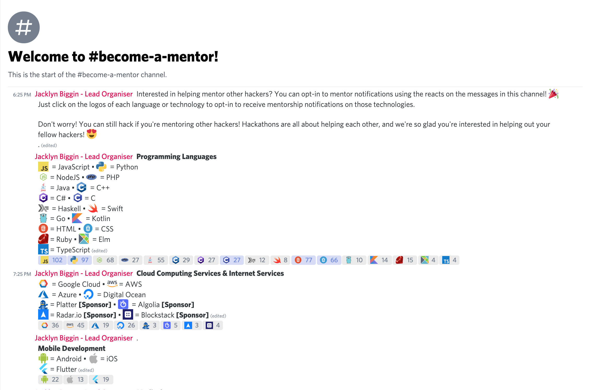

# zira-lang-emojis
Collection of common programming language emojis for use in tandem with the Discord bot [Zira](https://docs.zira.gg/docs/en/basics/) for self-assigned mentorship roles at hackathons

Read more about the purpose [here](https://www.murphyandhislaw.com/blog/how-to-run-a-digital-hackathon)

## Included emojis

**Programming Languages/frameworks**

- [x] Angular
- [x] C
- [x] C#
- [x] C++
- [x] CSS
- [x] Goland
- [x] HTML
- [x] Java
- [x] JavaScript
- [x] NodeJS
- [x] PHP
- [x] Python
- [x] React
- [ ] React Native
- [x] Python
- [x] Ruby
- [x] SQL
- [x] Swift
- [x] TypeScript
- [x] Vue

**Platform**
- [x] AWS
- [x] Azure
- [x] CockroachDB
- [x] DigitalOcean Cloud
- [x] EchoAR
- [x] Firebase
- [x] Flutter
- [x] Google Cloud
- [ ] Kubernetes
- [ ] Helm
- [x] MongoDB

**Device**
- [x] Android 
- [x] Apple

## TODO 
- [ ] Add more emojis!!!
- [ ] include thumbnails next to each